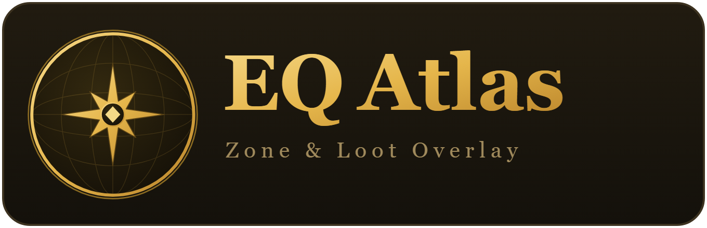

  

  <b>A transparent in-game overlay + searchable Atlas for the EverQuest Legends server.</b> 
  Follows your log and shows your current zone's named mobs, loot, and maps.

  <i>Reads only your EverQuest log file (like GINA / EQLogParser) — no game-memory access, no injection.</i>

---

## ⬇️ Download

**[Get the latest release »](../../releases/latest)** — download **`EQAtlas-share.zip`**, unzip it anywhere, and run **`EQAtlas.exe`**.

No install, no Python, nothing to set up.

## ▶️ Setup (30 seconds)

1. In EverQuest, turn logging on **once** — type: `/log on`
2. Double-click **`EQAtlas.exe`**.
   - A small transparent **HUD** floats over the game and shows your current zone's named mobs and their loot.
   - Click the **▤** button on the HUD to open the **full Atlas** — browse every zone, view maps, and search items.

> Play EQ in **windowed** or **borderless-window** mode (EQ *Options → Display*) so the overlay shows on top. It won't appear over exclusive fullscreen.

## ✨ What it does

- **In-game HUD** that auto-follows you zone to zone — and **highlights a named mob the moment you engage it**, so you instantly see its loot.
- **Full Atlas window** — named mobs, loot tables (rarity + drop %), zone maps, level ranges, expansion filter.
- **Item search** — look up any item and see exactly **which mobs and zones drop it**.
- **Hover any item** for its full stats (slot, AC, stats, focus).
- **One-click "Update data"** button to pull the latest from the wiki.

## 🎛️ HUD controls

| | |
|---|---|
| **Drag** the top bar | move it anywhere · drag the corner to resize |
| **▤** | open the full Atlas window |
| **🔒 / Ctrl+Alt+L** | click-through (play right through the HUD) |
| **📁** | point it at your EQ `Logs` folder if it can't find it |
| **– / +** | opacity · **✕** or **Ctrl+Alt+X** to close |

It remembers your size, position, and opacity for next time.

## 💻 Requirements

- **Windows 10 / 11** with **Microsoft Edge or Google Chrome** (Edge is built in, so any Windows PC works).
- On first launch, **Windows SmartScreen** may warn because the app isn't code-signed — click **More info → Run anyway**.

## ❔ Can't find your logs?

EQ Atlas auto-detects your EverQuest `Logs` folder. If it can't (EQ installed on another drive or a custom folder), click the **📁** button on the HUD and browse to your `Logs` folder — it's remembered from then on.

---

Data from the <a href="https://eqlwiki.com">EverQuest Legends Wiki</a> and its contributors. EverQuest is a trademark of Daybreak Game Company. This is an unofficial, non-commercial fan project and is not affiliated with or endorsed by the EQ Legends server or Daybreak.
